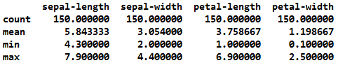

# Programming-and-Scripting-Project--Spring-2018
Julian Conneely, 2018-04-11\
*This repository contains Python code\
*Download Anaconda here https://www.anaconda.com/download/ to run the Python script(s)\
*I recommend you run these scripts in Visual Studio Code

# Project Plan
Incremental tasks checklist to be completed on the way to project completion
- [x] Research background information about the data set and write a summary of it
- [x] Keep a list of references used in completing the project
- [x] Download the data set and write some Python code to investigate it
- [x] Download the data set and write some Python code to investigate it
- [x] Summarise the data set using a Python script e.g. calculating the maximum, minimum and
mean of each column of the data set
- [x] Write a summary of investigations
- [x] Include supporting tables and graphics as necessary

# Background and Summary of the Data Set

A data set is a collection of data. Most commonly a data set corresponds to the contents of a single database table, or a single statistical data matrix, where every column of the table represents a particular variable, and each row corresponds to a given member of the data set in question. [7] The Iris flower data set is considered a classic data set for use in statistics.

The Iris data set is a multivariate data set introduced by the British statistician and biologist Ronald Fisher in his 1936 paper *'The use of multiple measurements in taxonomic problems as an example of linear discriminant analysis'.* [1]

[6]

Multivariate analysis (MVA) is based on the statistical principle of multivariate statistics, which involves observation and analysis of more than one statistical outcome variable at a time. In design and analysis, the technique is used to perform trade studies across multiple dimensions while taking into account the effects of all variables on the responses of interest. [2]

The data set consists of 50 samples from each of three species of Iris (Iris setosa, Iris virginica and Iris versicolor). Four features were measured from each sample: the length (column 1) and the width (column 2) of the sepals; the length (column 3) and the width (column 4) of the petals in centimetres. Based on the combination of these four features, Fisher developed a linear discriminant model to distinguish the species from each other. [1]

It includes three Iris species with 50 samples each as well as some properties about each flower. One flower species is linearly separable from the other two, but the other two are not linearly separable from each other. [3]

If we look at the colour coded scatter plot below, a set of points is said to be linearly separable if there exists at least one line in the plane with all of the red points (Iris-setosa) on one side of the line and all the points (green Iris-versicolor and blue Iris-virginica) on the other side.

[5]

## Colour coded Scatter Plot: Sepal Width vs. Sepal Length

[4]

# Summary of investigations

Setup: 

Firstly all of the necessary Python libraries were imported to Python (see Section A of IrisProject.py script). \
Secondly I imported the Iris dataset to Python as a CSV file and viewed the data set using the Head method. (see Section B of IrisProject.py script). \
I then used numpy to calculate the max, min and mean of each column (see IrisMax, IrisMin and IrisMean scripts). \
I also used pandas and matplotlib.pyplot [8] to generate some graphs and visual representations of the data set. \
Lastly I generated some summary statistics and analysis of the Iris dataset.

Analysis: 

I was unsure as to whether to use multiple different python scripts or to incorporate all into one so I chose multiple scripts for clarity in the end.

I used Matplotlib to generate a barplot of the anatomical features of the Iris species, this barplot shows how the three species of Iris differ on the basis of their four anatomical features (see Section B of IrisMean script). 
*Figure_3 Barplot of the anatomical features of the Iris species.png* shows that Iris Virginia has the longest sepal length, petal length and petal width, with Setosa having the longest sepal width. It also shows that all three species have similar sepal widths; with Setosa having much smaller petals than both Versicolor and Virginica. 

Calculating the max, min and the mean of each column (see IrisMax, IrisMin and IrisMean scripts) is a useful way of practising data analysis using Python libraries, however it does not in my opinion provide particularly useful information that is enlightening in terms of analysing the Iris Data Set. One observation is that sepal length ranges from 4.3cm to 7.9cm, while petal length has a much wider range of 1.0cm to 6.9cm. 

Indeed looking at *Figure_1 Histogram of Iris Column 1.png* you can see that column 1 (sepal length in cm) of the Iris Data set has 3 distinct peaks (between 4.7 and 5.0cm; between 5.4 and 5.6cm; and between 6.1 and 6.5cm). An example of a much more insightful graphic display of the data set. This histogram was created using the matplotlib.pyplot library and utilising the pl.hist and pl.show commands (see section B of IrisMean.py)

A potentially more useful set of data calculations to analyse would be the Scatter Plot Matrix (Figure 2) and the Scatter Plot of all of the Iris data set variables (Figure 4). A scatter plot is a graph in which a set of points plotted on a horizontal and vertical axes. As scatter plots show the extent of correlation between the values of the variables, they are an important tool in statistics. If there is no correlation between the variables the points will show randomly scattered on the coordinate plane. But, if there is a large correlation between the variables, the points concentrate near a straight line. Therefore, scatter plots are quite useful for data visualization as they illustrate a trend. Scatter plots shows not only the extent of correlation, but also the sense of the correlation. [12]

The Scatter Plot matrix highlights that Iris Setosa is linearly separable from the other two species; there is considerable overlap between Iris Virginica and Iris Versicolor suggsting a high correlation and predictable relationship. 

Thus to distinguish between Iris Virginica and Iris Versicolor, we have to analyse some other features. They can be seperated on the basis of Petal Length and Petal Width. In the plot between petal width verses petal length, the petal width and length of Iris Versicolor is smaller than that of Iris Virginica. [11]

New learnings while completing this project include: Using new Python libraries e.g. NumPy, Pandas, Matplotllib; Learning how to produce and create visual outputs e.g. histograms, scatter plots while also understanding their outputs; Calculating the min, max and values; Running iPython as an active terminal to test code and outputs before committing them to scripts; Learning new GitHUb functonality e.g. Markdown and the Issues tab. [9]. Resizing image files [10]

# References
[1] https://en.wikipedia.org/wiki/Iris_flower_data_set \
[2] https://en.wikipedia.org/wiki/Multivariate_analysis \
[3] https://www.kaggle.com/uciml/iris \
[4] http://www.pybloggers.com/wp-content/uploads/2015/09/ratherreadblog.comwp-contentuploads201509iris_scatter-9c511da385a5344b661e2153e84c28382116721d.png \
[5] http://www.lac.inpe.br/~rafael.santos/Docs/R/CAP394/WholeStory-Iris.html \
[6] http://www.nndb.com/people/763/000196175 \
[7] https://en.wikipedia.org/wiki/Data_set \
[8] https://matplotlib.org/users/pyplot_tutorial.html \
[9] https://guides.github.com/features/mastering-markdown \
[10] https://gist.github.com/uupaa/f77d2bcf4dc7a294d109 \
[11] https://www.kaggle.com/farheen28/iris-dataset-analysis-using-knn \
[12] https://towardsdatascience.com/pca-using-python-scikit-learn-e653f8989e60 
